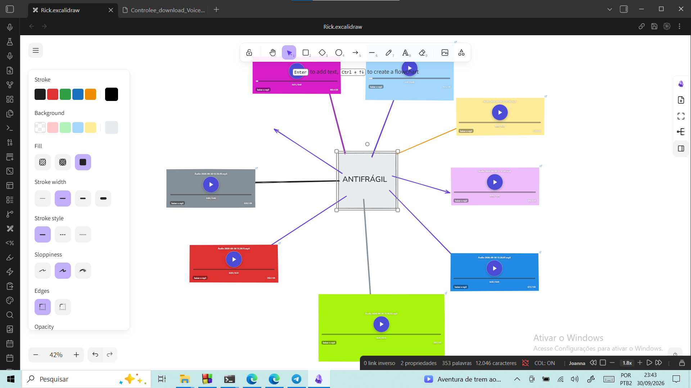

# VoiceComment 2.0

Record a voice note and get a **rectangle on your Excalidraw drawing** that plays it.

The rectangle shows a self-contained HTML page with the audio inside — generated next to the MP3 and served by a small server the plugin runs on your own machine. It is **always stopped**: it never plays on its own, and it **comes back when you reopen the drawing**.

No ffmpeg, no Python, no cloud: the MP3 encoder ships inside the plugin.



*One comment per idea, parked on the drawing itself.*

## Why

Neither Excalidraw nor its plugin can record audio, and even embedding an existing audio file in a drawing is a manual workaround — [issue #2278](https://github.com/zsviczian/obsidian-excalidraw-plugin/issues/2278) is still open, and the suggested workaround is to add a card and drop an audio link into it. VoiceComment does that for you, with the recording included: one comment per idea, parked exactly where you were.

## What you get

Every recording writes two files into your vault folder:

| File | What it is for |
|---|---|
| `VoiceComment 2026-01-31 18.20.33.mp3` | the audio itself, usable in any other program |
| `VoiceComment 2026-01-31 18.20.33.html` | the page the rectangle shows — openable in a browser too |

and one element inside the drawing, which is what makes the rectangle come back.

## The audio never plays by itself

Two guarantees, added up:

1. The generated page has **no** `autoplay` attribute.
2. Excalidraw creates the rectangle as a *webview* with `autoplayPolicy=document-user-activation-required` — the drawing plugin itself requires a user click before any sound.

Measured in the app after closing and reopening the drawing: the player comes back with the audio **loaded and ready** (`readyState: 4`), at `currentTime: 0`, `paused: true`, no autoplay. It only plays when you click it.

## Requirements

- Obsidian 1.4.0 or newer, **desktop version** — the plugin keeps a small local server and opens its log through Electron, so it is marked desktop-only
- A microphone, and permission for Obsidian to use it
- The [Excalidraw](https://github.com/zsviczian/obsidian-excalidraw-plugin) plugin, version 2.x, for the drawing part

## Installation

### Community plugins

Settings → Community plugins → Browse → search "VoiceComment 2.0" → **Install** → **Enable**.

### BRAT

Add `Engenharick/voicecomment` to [BRAT](https://github.com/TfTHacker/obsidian42-brat).

### Manual

Download `main.js`, `manifest.json` and `styles.css` from the [latest release](https://github.com/Engenharick/voicecomment/releases/latest), put them in `<vault>/.obsidian/plugins/voicecomment/`, and enable the plugin in Settings → Community plugins.

## Usage

1. Open an Excalidraw drawing.
2. Click the **microphone** in the sidebar — or run *VoiceComment 2.0: record audio and plot it on the drawing*.
3. Talk. Click **■ Stop and plot** to finish (or run the command again).
4. The rectangle appears in the middle of the view, with the audio already loaded and stopped.

The plugin deliberately ships **no default hotkey**, so it never steals a key you already use — assign one in Settings → Hotkeys if you prefer the keyboard.

Two extra commands help when things move around:

- *Replot the last recording on the drawing* — for when you closed the view before the rectangle was written
- *Rebuild the HTML pages of this folder* — regenerates the page of every MP3 in the recordings folder with the current player and colors

## Settings

| Setting | Description |
|---|---|
| Recordings folder | Vault folder for the MP3 and the HTML. Created if missing. |
| MP3 quality | 64 / 96 / 128 / 192 kb/s, mono. |
| Width / Height | Size of the plotted rectangle (470 × 200 by default). |
| Border colour / Background colour | Colours the drawing paints behind the page. `transparent` (default) keeps the rectangle colourless. |
| Port | Port of the local server (8781 by default), with a *Restart server* button. |
| Microphone icon | Show or hide the sidebar icon. |
| Diagnostic log | Opens the plugin log, which records every request the server answers. |

## Limits (honest ones)

- **This PC only.** The rectangle shows a page served by the plugin running here. On another machine, or with Obsidian closed, the rectangle is empty — the MP3 and the HTML stay valid anywhere.
- **Changing the port breaks the rectangles you already plotted**: their URL is stored inside the drawing. If the port is busy, the plugin tries the next 10 and warns.
- The rectangle shows the **browser's** player inside a webview — not a native player.
- The drawing part needs the Excalidraw plugin; without it there is nothing to plot into.

## Troubleshooting

- **The rectangle is empty**: check the diagnostic log. Every request the server answers is logged (`servidor: GET /… .html -> 200` is what proves the page loaded). A port change is the usual cause.
- **"the port was busy"**: another program (or another copy of the plugin) took 8781. The plugin moves to the next free port and warns that old rectangles may not load.
- **"microphone permission denied"**: allow microphone access for Obsidian in your system privacy settings.
- **"nothing was recorded"**: open the log — it records the AudioContext state, the captured byte counts and the peak level of every recording.

## How it works

```
microphone → PCM (WebAudio) → lamejs → MP3 ─┬─> <name>.mp3  (in the vault)
                     └── MediaRecorder ──────┘
                                            └─> <name>.html (audio in base64)
                                                     ↑
    local server 127.0.0.1:8781 (this machine only) serves that folder
                                                     ↑
    an "embeddable" element in the drawing points to http://127.0.0.1:8781/<name>.html
    (Excalidraw sends any protocol link to a webview with the no-autoplay policy)
```

- Capture runs **two parallel paths**: raw PCM through WebAudio straight into the MP3 encoder (a single lossy generation), plus a `MediaRecorder` safety net. If the PCM path delivers nothing — a suspended `AudioContext` is the classic cause, and the timer keeps running anyway, which is misleading — the compressed capture is decoded with `decodeAudioData` and re-encoded. A recording is never lost.
- The server accepts only `GET`/`HEAD`, only from `127.0.0.1`, and serves only files **inside** the recordings folder (no `../`). Every request is written to the plugin log.

## Development

```powershell
powershell -File build.ps1                 # main.js = src/lame.min.js + src/audiohtml.js, then installs into the vault
powershell -File build.ps1 -Vault "C:\path\to\vault"
node --check main.js
```

Checking it with the app open (`Obsidian.exe --remote-debugging-port=9333`):

```powershell
node tools\verificar-retangulo.js 9333 "<path\to\an.mp3>" apagar voicecomment
node tools\limpar-teste.js 9333          # if a test died halfway: deletes only zz-teste files
```

`verificar-retangulo.js` records through the plugin's real path, plots, checks the server log for the page load, closes and reopens the drawing to prove the rectangle comes back — and deletes only the `zz-teste-` files it created. With a heavily loaded vault the reopen step can be slow: it fails soft, prints what it measured and still cleans up.

## Credits

- [lamejs](https://github.com/zhuker/lamejs) (LGPL-3.0) — MP3 encoding, bundled unmodified. See [THIRD-PARTY-NOTICES.md](THIRD-PARTY-NOTICES.md).
- [Excalidraw for Obsidian](https://github.com/zsviczian/obsidian-excalidraw-plugin) by Zsolt Viczián — the `ExcalidrawAutomate` API that makes the drawing part possible.

## License

LGPL-3.0 — see [LICENSE](LICENSE).
