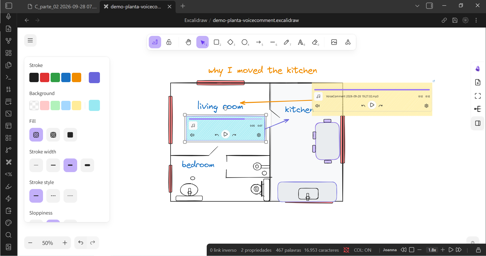
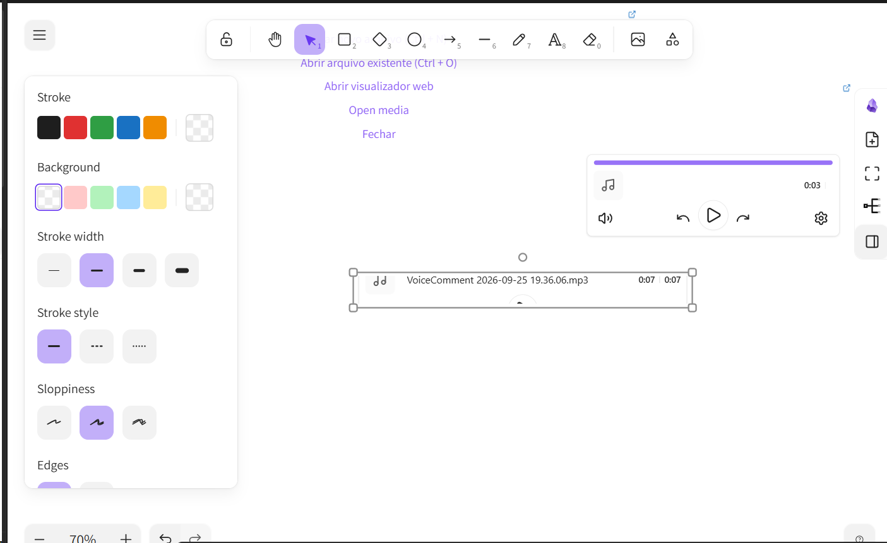

# VoiceComment

Record a voice note and drop the MP3 player **right where you started recording** — in a Markdown note, or inside an Excalidraw drawing.

Assign a shortcut to *VoiceComment: Start/stop recording* (Settings → Hotkeys) — `Alt+R` is a good one — talk, then press it again. The plugin deliberately ships **no default hotkey**, so it never steals a key you already use. The recording is encoded to MP3 inside Obsidian (no ffmpeg, no Python, no cloud), saved into your vault, and the audio player is inserted automatically at the cursor — or as a playable element in the middle of your drawing.

*The player stays where the comment was recorded - here a 0:12 note parked on the floor plan itself, next to the lines it explains.*

*Closer look at the player: the file it just recorded, playable from the scene.*

## Why

Neither Excalidraw nor its Obsidian plugin can record audio, and even embedding an existing audio file in a drawing is a manual workaround. [Issue #2278](https://github.com/zsviczian/obsidian-excalidraw-plugin/issues/2278) is still open, and the plugin's author suggests working around it by adding a card and dropping the audio link into it. VoiceComment does exactly that — automatically, with the recording included.

VoiceComment is where the two meet: Obsidian records the voice, the Excalidraw canvas gives it a place. The comment stops being a file that sits somewhere else and becomes part of the drawing itself - the creative value the two add together, which neither reaches alone.

## Features

- 🎙️ One shortcut for everything — bind a key once (say `Alt+R`) and it starts and stops from anywhere
- 📝 Works in Markdown notes — inserts `![[audio.mp3]]` at the cursor
- ✏️ Works inside Excalidraw drawings — inserts a real, playable player element in the scene
- 💾 MP3 written straight to your vault, with **no external tools**: the encoder ships inside the plugin
- ⏸️ Pause/resume, live level meter, timer, discard
- 📊 Status bar indicator and a floating panel showing which file you are recording into
- 🔒 100% local — nothing leaves your machine
- 🖥️ Desktop version of Obsidian

## Requirements

- Obsidian 1.4.0 or newer, **desktop version** — the plugin opens its diagnostic log through Obsidian's Electron API, so it is marked desktop-only
- A microphone, and permission for Obsidian to use it
- For the drawing part: the [Excalidraw](https://github.com/zsviczian/obsidian-excalidraw-plugin) plugin, version 2.x

## Installation

### Community plugins

Settings → Community plugins → Browse → search "VoiceComment" → **Install** → **Enable**. The plugin is listed in the official community directory, so this is all it takes.

### BRAT

Add `Engenharick/voicecomment` to [BRAT](https://github.com/TfTHacker/obsidian42-brat).

### Manual

Download `main.js`, `manifest.json` and `styles.css` from the [latest release](https://github.com/Engenharick/voicecomment/releases/latest), put them in `<vault>/.obsidian/plugins/voicecomment/`, and enable the plugin in Settings → Community plugins.

## Usage

1. Open a note (in edit mode) **or** an Excalidraw drawing.
2. Press your shortcut — or click the microphone in the sidebar, or run *VoiceComment: Start/stop recording* from the command palette. No shortcut yet? Assign one in Settings → Hotkeys.
3. Talk. The panel shows the timer, the level meter, and the file being recorded into.
4. Press the shortcut again (or ■ in the panel) to stop and save.

**No hotkey needed.** Click the microphone in the sidebar to start and stop, so the mouse alone is enough. Comment on whatever you are working on, and record as many audios as you want - one comment per idea you still want to develop, each player dropped where you were. With a drawing open, that same click is what puts the player into the Excalidraw scene - the recorder is Obsidian's, the place is the drawing's.

| Where you record | What appears |
|---|---|
| Markdown note | `![[VoiceComment 2026-09-25 18.20.33.mp3]]` at the cursor |
| Excalidraw drawing | a player element in the middle of the view, selected and ready to play |

Autoplay is disabled by the browser (see [#1657](https://github.com/zsviczian/obsidian-excalidraw-plugin/issues/1657)), so you press play once.

Without the Excalidraw plugin there is nothing to draw into, so recording with a drawing open simply inserts the audio into that note instead. Nothing breaks — the file is always saved.

## Settings

| Setting | Description |
|---|---|
| Recordings folder | Vault folder for the MP3s. Created automatically if missing. |
| File name prefix | Base name; the date and time are appended to it. |
| MP3 quality | 64 / 96 / 128 / 192 kb/s, mono. |
| Insert the recording | At the cursor (edit mode) or at the end of the note. |
| Microphone icon in the sidebar | Show or hide the ribbon icon. |
| Diagnostic log | Opens `.obsidian/plugins/voicecomment/voicecomment.log`. |

## Troubleshooting

- **Nothing happens on your shortcut**: it may never have been assigned (the plugin ships none), or another plugin owns it. Assign it in Settings → Hotkeys → search "VoiceComment".
- **"microphone permission denied"**: allow microphone access for Obsidian in your OS privacy settings, then try again.
- **"nothing was recorded"**: open the diagnostic log. It records the AudioContext state, the captured byte counts and the peak level of every recording.
- **The player shows up as an empty box in a drawing**: it was inserted but not activated. It renders as soon as you select it.

## How it works

1. **Capture, in two parallel paths.** Raw PCM through WebAudio (`ScriptProcessor`) feeds the MP3 encoder directly, so there is a single lossy generation. At the same time a `MediaRecorder` captures the same stream. If the WebAudio path delivers no samples — a suspended `AudioContext` is the classic cause, and the timer keeps running anyway, which is misleading — the compressed capture is decoded with `decodeAudioData` and re-encoded, so a recording is never lost.
2. **MP3.** [lamejs](https://github.com/zhuker/lamejs) is bundled, so there is no ffmpeg, Python or cloud dependency. 44.1 kHz mono.
3. **Note.** The file is written through the vault API and `![[…]]` is inserted at the cursor, or appended to the note.
4. **Drawing.** `window.ExcalidrawAutomate.getAPI(view)` returns an instance bound to the drawing's view; `addEmbeddable(...)` creates the audio element (transparent stroke and background, height measured from an offscreen `<audio controls>`), `addElementsToView(false, true, true)` persists it, and selecting it plus `updateScene({ appState: { activeEmbeddable: … } })` is what makes the player render. `ea.destroy()` is always called.

## Credits

- [lamejs](https://github.com/zhuker/lamejs) (LGPL-3.0) — MP3 encoding, bundled unmodified. See [THIRD-PARTY-NOTICES.md](THIRD-PARTY-NOTICES.md).
- [Excalidraw for Obsidian](https://github.com/zsviczian/obsidian-excalidraw-plugin) by Zsolt Viczián — the `ExcalidrawAutomate` API that makes the drawing part possible.

## License

LGPL-3.0 — see [LICENSE](LICENSE).
